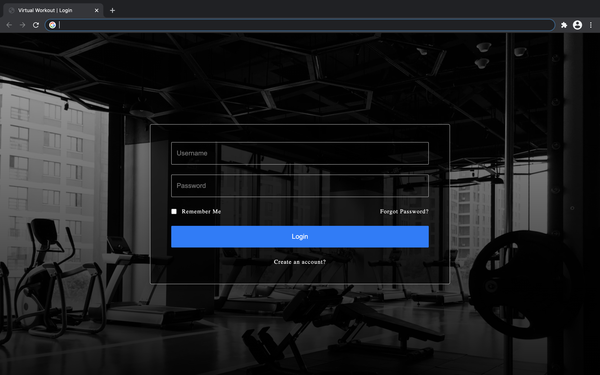
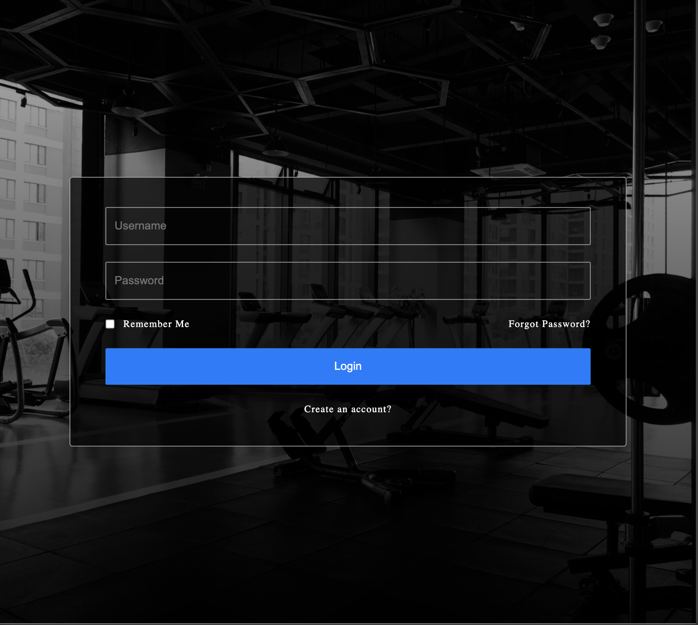
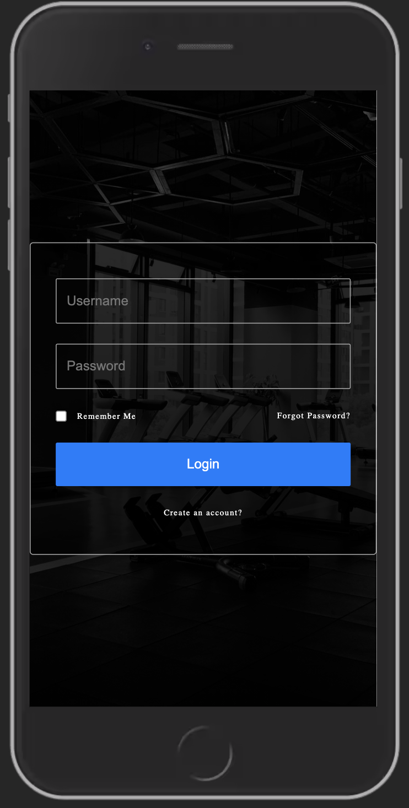

# Login Page

## Acceptance Criteria

- [ ] Login form should have a username input field
- [ ] Login form should have a password input field
- [ ] Login form should have a "Remember Me" checkbox
- [ ] Login form should have a "Forgot Password?" link
- [ ] Login form should have a "Login" button
- [ ] Login form should have a "Create an account?" link
- [ ] Login form should be at 100% width for viewports up to 600px
- [ ] Login form should be at 80% width for viewports up to 992px
- [ ] Login form should be at 50% width for viewports above 992px
- [ ] Styles and layout should match design requirements
- [ ] Use the background image provided for the login page
- [ ] Webpage should use basic HTML5 meta tags
- [ ] Webpage should have a title "Virtual Workout | Login"

## Designs

### Large Viewports

### Medium Viewports

### Small Viewports

